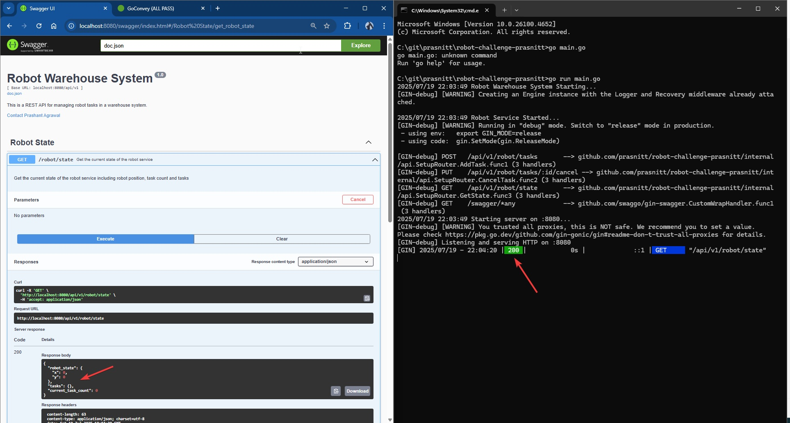
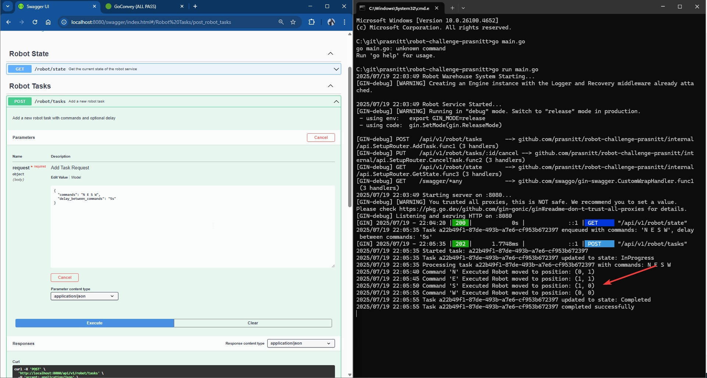
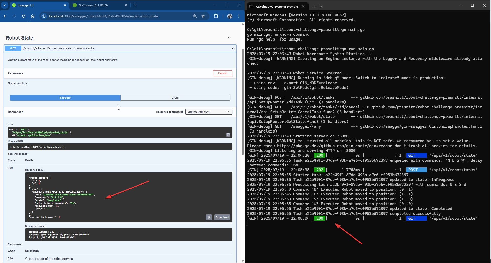
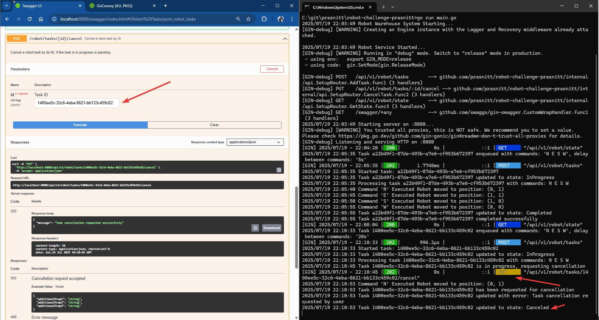

# Robot Warehouse System

A comprehensive REST API system for controlling a warehouse robot with command sequencing, task management, and real-time status monitoring.


## 📋 Overview

This implementation provides a complete solution for the robot warehouse challenge with the following key features:

### **🎯 Solution Approach**
- **RESTful API Design**: Built using Go Gin framework for high-performance HTTP routing
- **Concurrent Task Processing**: Implements goroutines and channels for non-blocking task execution
- **Thread-Safe Operations**: Uses mutexes to ensure data consistency across concurrent operations
- **Robust State Management**: Comprehensive task lifecycle with states (Pending → InProgress → Completed/Canceled/Aborted)
- **Boundary Validation**: Prevents robot from moving outside the 10x10 warehouse grid
- **Graceful Task Cancellation**: Supports real-time task cancellation even during execution

### **📊 System Architecture Diagram**

*The system follows a clean architecture pattern with separation of concerns between API handlers, business logic, and state management.*
```
┌─────────────────────────────────────────────────────────────────────────────────┐
│                              Robot Warehouse System                             │
│                                                                                 │
│  ┌──────────────────┐    ┌─────────────────┐    ┌─────────────────────────────┐ │
│  │   REST API       │    │   Robot Service │    │      Warehouse Grid         │ │
│  │   (Gin Router)   │    │                 │    │        (10x10)              │ │
│  │                  │    │                 │    │ (0,10)             (10,10)  │ │
│  │ POST /tasks      │◄──►│ EnqueueTask()   │    │  ┌─┬─┬─┬─┬─┬─┬─┬─┬─┬─┐      │ │
│  │ GET /state       │    │ CancelTask()    │    │  │ │ │ │ │ │ │ │ │ │ │      │ │
│  │ PUT /cancel      │    │ CurrentState()  │    │  ├─┼─┼─┼─┼─┼─┼─┼─┼─┼─┤      │ │
│  │                  │    │ ExecuteTask()   │    │  │ │ │ │ │ │ │ │ │ │ │      │ │
│  │ Swagger UI       │    │                 │    │  ├─┼─┼─┼─┼─┼─┼─┼─┼─┼─┤      │ │
│  └──────────────────┘    │ ┌─────────────┐ │    │  │ │ │ │ │🤖 │ │ │ │ │      │ │
│                          │ │ Task Queue  │ │    │  ├─┼─┼─┼─┼─┼─┼─┼─┼─┼─┤      │ │
│                          │ │(Channel)    │ │    │  │ │ │ │ │ │ │ │ │ │ │      │ │
│                          │ │Max: 100     │ │    │  ├─┼─┼─┼─┼─┼─┼─┼─┼─┼─┤      │ │
│                          │ └─────────────┘ │    │  │ │ │ │ │ │ │ │ │ │ │      │ │
│                          │                 │    │  └─┴─┴─┴─┴─┴─┴─┴─┴─┴─┘      │ │
│                          │ ┌─────────────┐ │    │  (0,0)              (10,0)  │ │
│                          │ │Service State│ │    └─────────────────────────────┘ │
│                          │ │- Robot Pos  │ │                                    │
│                          │ │- Tasks Map  │ │    ┌─────────────────────────────┐ │
│                          │ │- Task Count │ │    │         Task States         │ │
│                          │ └─────────────┘ │    │                             │ │
│                          └─────────────────┘    │                             │ │
│                                                 │        Task State Flow      │ │
│  ┌──────────────────────────────────────────┐   │                             │ │
│  │              Concurrency                 │   │      Pending                │ │
│  │                                          │   │       │   │                 │ │
│  │ • Goroutines for task processing         │   │       │   └─► Canceled      │ │
│  │ • Mutex for thread-safe operations       │   │       ▼                     │ │
│  │ • Context for graceful shutdown          │   │  InProgress                 │ │
│  │ • Channels for task communication        │   │    │    │    │              │ │
│  └──────────────────────────────────────────┘   │    │    │    └─► Aborted    │ │
│                                                 │    │    │                   │ │
│                                                 │    │    └─► RequestCancel.. │ │
│                                                 │    │             │          │ │
│                                                 │    │             ▼          │ │
│                                                 │    ▼          Canceled      │ │
│                                                 │ Completed                   │ │
│                                                 └─────────────────────────────┘ │
└─────────────────────────────────────────────────────────────────────────────────┘
```
---

### **🔄 System Architecture & Code Flow**

```
📥 HTTP Request → 🎯 Gin Router → 🤖 Robot Service → 📊 State Management → 🏭 Task Execution
```

1. **API Layer**: Handles HTTP requests with validation and response formatting
2. **Service Layer**: Manages robot logic, task queuing, and state transitions
3. **Task Processing**: Executes commands sequentially with configurable delays
4. **State Persistence**: Maintains robot position and task status in memory
5. **Concurrency Control**: Uses channels for task queuing and mutexes for data safety

### **🧪 Quality Assurance**
- **Comprehensive Unit Tests**: 88.9% code coverage with 50+ test cases
- **API Integration Tests**: Complete REST endpoint testing with mock services
- **Concurrent Testing**: Validates thread safety and race condition handling
- **Swagger Documentation**: Interactive API documentation with examples

## 📦 Packages Used

| Package | Version | Purpose | Description |
|---------|---------|---------|-------------|
| [Gin](https://github.com/gin-gonic/gin) | v1.10.1 | Web Framework | High-performance HTTP web framework |
| [Swaggo](https://github.com/swaggo/swag) | v1.16.5 | API Documentation | Swagger documentation generator |
| [Gin-Swagger](https://github.com/swaggo/gin-swagger) | v1.6.0 | Swagger UI | Swagger UI middleware for Gin |
| [UUID](https://github.com/google/uuid) | v1.6.0 | ID Generation | Unique task identifier generation |
| Go Standard Library | - | Core Logic | Context, sync, time, testing packages |

---

## 🚀 Setup & Run

### **Prerequisites**
- Go 1.24+ installed on your system
- Git for version control

### **Installation Steps**

1. **Clone the repository**
   ```bash
   git clone https://github.com/prasnitt/robot-challenge-prasnitt.git
   cd robot-challenge-prasnitt
   ```

2. **Install dependencies**
   ```bash
   go mod download
   go mod tidy
   ```

3. **Generate Swagger documentation** (Optional)
   ```bash
   swag init
   ```

4. **Run unit tests** (optional but recommended)
   ```bash
   go test ./... -v
   ```

5. **Start the application**
   ```bash
   go run main.go
   ```

6. **Access the system**
   - **API Base URL**: `http://localhost:8080/api/v1`
   - **Swagger UI**: `http://localhost:8080/swagger/index.html`
   - **Interactive API Testing**: Use Swagger UI to test all endpoints

### **📝 Usage Instructions**

1. **Open Swagger UI** at `http://localhost:8080/swagger/index.html`
2. **Test API endpoints** using the interactive interface
3. **Monitor logs** in the terminal to see task execution flow
4. **Check robot movement** by calling the `/robot/state` endpoint

---

## 📸 Screenshots

| API Endpoint | Screenshot | Description |
|--------------|------------|-------------|
| **GET /robot/state** |  | Shows robot at origin (0,0) with empty task queue |
| **POST /robot/tasks** |  | Create task with commands "N E S W" and 5s delay |
| **GET /robot/state** (after task) |  | Shows robot moved back to origin with completed task |
| **PUT /robot/tasks/{id}/cancel** |  | Demonstrates real-time task cancellation |

### **Suggested API Testing Flows**

1. **Basic Flow**: Create task → Check state → Watch logs for execution
2. **Cancellation Flow**: Create long task → Cancel mid-execution → Verify cancellation
3. **Boundary Testing**: Create task that exceeds warehouse limits → See validation error
4. **Multiple Tasks**: Create several tasks → Observe sequential processing

---

## 🔮 Future Improvements

### **Configuration Management**
1. **Environment Variables**: Replace hardcoded values (port 8080, warehouse size 10) with configurable environment variables
2. **Config Files**: Support JSON/YAML configuration files for deployment flexibility

### **Scalability Enhancements**
4. **Infinite Task Queue**: Replace limited channel (100 tasks) with persistent queue (e.g. RabbitMQ/Database)
5. **Database Integration**: Store robot state and task history in PostgreSQL/MongoDB
6. **Horizontal Scaling**: Support multiple service instances with load balancing

### **Advanced Robot Intelligence**
7. **Path Optimization**: Instead of step-by-step commands, provide destination coordinates and let robot calculate optimal path
8. **Obstacle Avoidance**: Implement collision detection and dynamic path recalculation
9. **Multi-Robot Support**: Support multiple robots working simultaneously in the same warehouse

### **User Experience**
10. **Real-time Dashboard**: Web-based UI showing live robot position and task status
11. **WebSocket Integration**: Real-time notifications when tasks complete
12. **Task Scheduling**: Support for delayed task execution and recurring tasks


---

## 🧩 API Endpoints

| Method | Endpoint | Description | Request Body | Response |
|--------|----------|-------------|--------------|----------|
| `GET` | `/api/v1/robot/state` | Get current robot state and tasks | None | `ServiceState` |
| `POST` | `/api/v1/robot/tasks` | Create new robot task | `AddTaskRequest` | `{task_id}` |
| `PUT` | `/api/v1/robot/tasks/{id}/cancel` | Cancel existing task | None | `{message}` |

---

## 🏗️ Project Structure

```
robot-challenge-prasnitt/
├── docs/                     # Swagger documentation
├── internal/
│   ├── api/                  # HTTP handlers and routing
│   │   ├── handlers.go       # API endpoint handlers
│   │   ├── handlers_test.go  # API handler tests
│   │   └── routers.go        # Route configuration
│   └── robot/                # Core business logic
│       ├── command.go        # Robot command definitions
│       ├── service.go        # Main service implementation
│       ├── service_test.go   # Service unit tests
│       ├── state.go          # State management
│       ├── task.go           # Task creation and parsing
│       └── task_test.go      # Task unit tests
├── main.go                   # Application entry point
├── go.mod                    # Go module definition
└── README.md                 # Project documentation
```

---

# Problem Statement

We have installed a robot in our warehouse and now we need to send it commands to control it. We need you to implement the high level RESTful APIs, which can be called from a ground control station.

For convenience the robot moves along a grid in the roof of the warehouse and we have made sure that all of our warehouses are built so that the dimensions of the grid are 10 by 10. We've also made sure that all our warehouses are aligned along north-south and east-west axes. The robot also builds an internal x y coordinate map that aligns to the warehouse's physical dimensions. On the map, point (0, 0) indicates the most south-west and (10, 10) indicates the most north-east.

All of the commands to the robot consist of a single capital letter and different commands are delineated by whitespace.

The robot should accept the following commands:

- N move north
- W move west
- E move east
- S move south

**Example command sequences:**

The command sequence: "N E S W" will move the robot in a full square, returning it to where it started.

If the robot starts in the south-west corner of the warehouse then the following commands will move it to the middle of the warehouse.

"N E N E N E N E"

## Robot SDK Interface 

The robot provides a set of low level SDK functions in GO to control its movement. 

```go
type Warehouse interface {
	Robots() []Robot
}

type Robot interface {
	EnqueueTask(commands string) (taskID string, position chan RobotState, err chan error) 

	CancelTask(taskID string) error

	CurrentState() RobotState
}

type RobotState struct {
	X uint
	Y uint
	HasCrate bool
}
```

## Requirements
- Create a RESTful API to accept a series of commands to the robot. 
- Make sure that the robot doesn't try to move outside the warehouse.
- Create a RESTful API to report the command series's execution status.
- Create a RESTful API cancel the command series.
- The RESTful service should be written in Golang.

## Challenge
- The Robot SDK is still under development, you need to find a way to prove your API logic is working.
- The ground control station wants to be notified as soon as the command sequence completed. Please provide a high level design overview how you can achieve it. This overview is not expected to be hugely detailed but should clearly articulate the fundamental concept in your design.
